# 外卖点餐系统小程序

#### 一、介绍

本项目是给某大学餐厅开发的外面点餐系统，该项目针对校内的学生，配送由学校的学生负责配送。因此，该项目不同于互联网的外卖点餐系统。

该系统支持属于 Saas 系统，由平台端、商家端、用户端、以及配送端组成。

其中，平台端、商家端是由基于 PHP 语言的 ThinkCMF 之上进行开发；用户端及配送端使用 UniAPP 开发。

该系统已经开发了常见的支付、退款、小票打印、优惠券等常用功能。

#### 二、技术选型

1. HTML + CSS + JavaScript
2. UniAPP
3. PHP
4. ThinkCMF
5. MySQL
6. Redis
7. Nginx
8. 飞蛾打印机

#### 三、实现功能

1. 平台端
- 网站信息、用户操作管理
- 用户管理、管理员、本站用户
- 会员管理、骑手管理、商家类型、商家管理
- 配送时间段管理、配送地址管理、平台配置、抽成管理
- 广告管理、菜单管理、通知管理
- 优惠券、充值余额、月卡计次套餐
- 商家对账管理、平台订单管理

2. 商家
- 店铺管理
- 菜品分类、菜品列表
- 商家订单管理、商家对账管理

3. 用户端
- 活动营销、活动菜单、商家列表
- 订单列表、订单退款
- 会员服务、优惠券、会员充值、余额管理、代金券、月卡
- 我的收藏、地址管理、账号设置、关于我们、骑手登录

4. 配送端
- 上线/休息
- 今日配送单数、历史订单
- 待接单、待取货、配送中

#### 四、系统平台功能导图

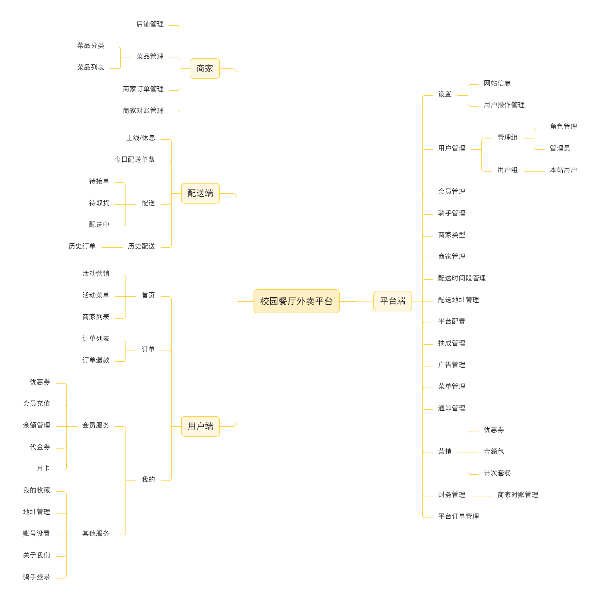

#### 平台系统界面展示

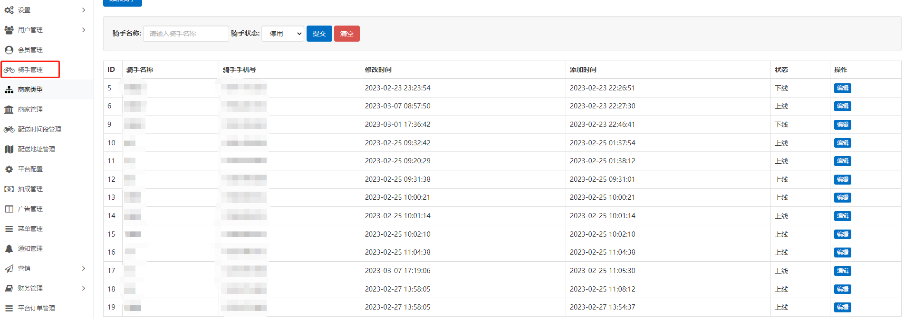
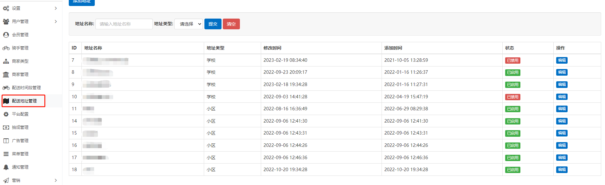
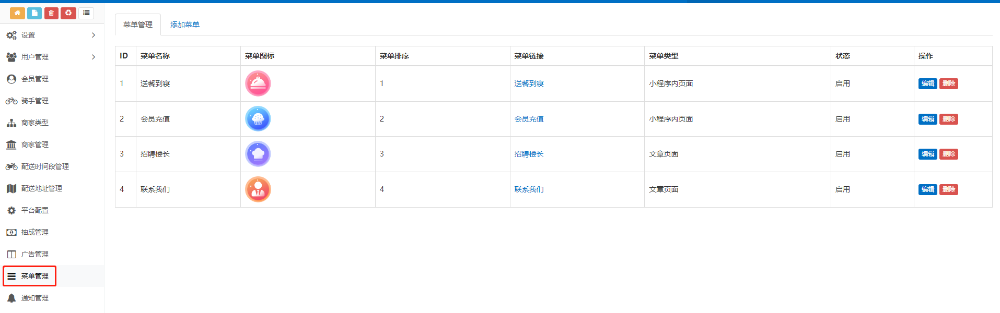
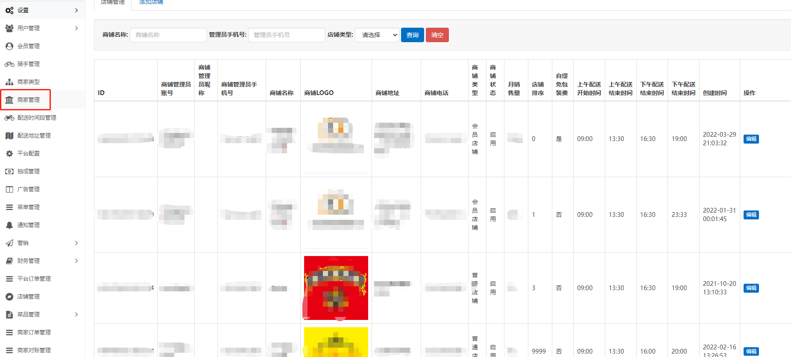
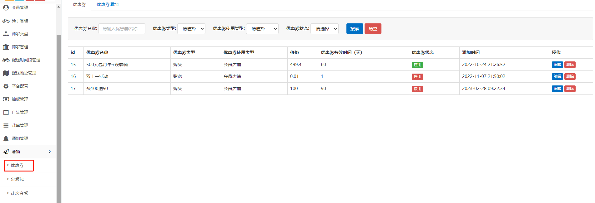

#### 商家系统界面展示

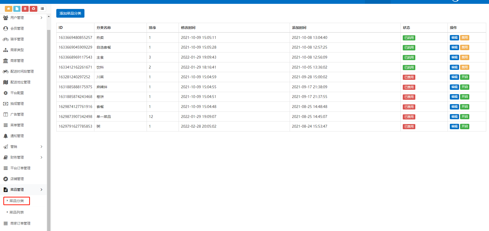
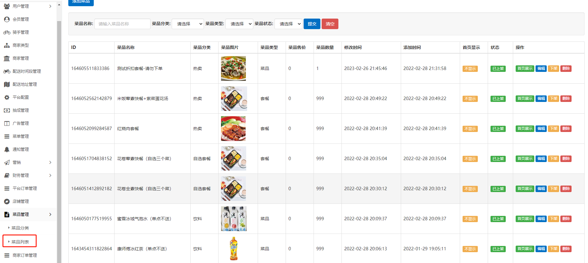

#### 用户端小程序界面展示

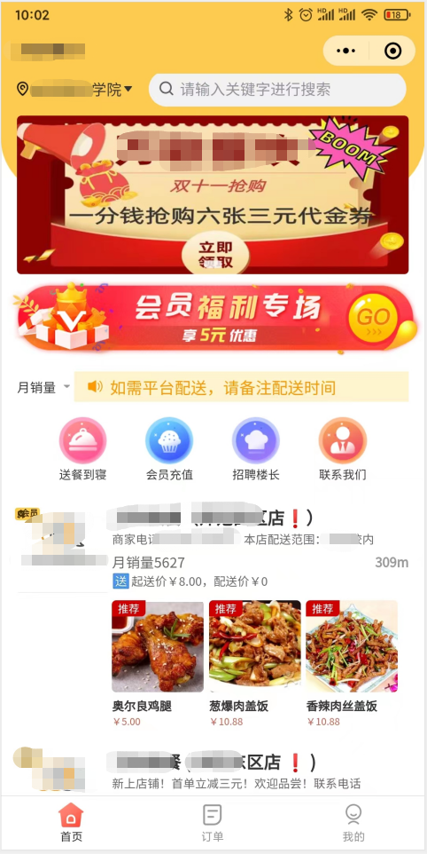
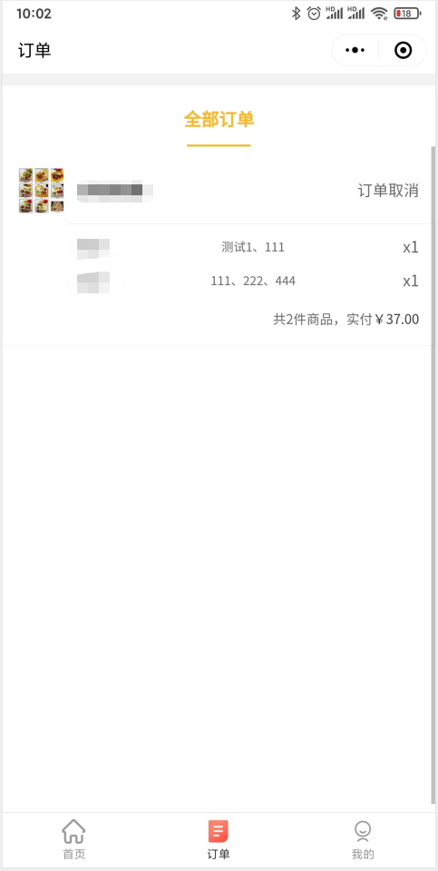
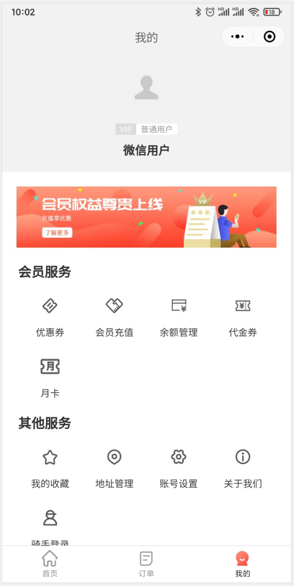
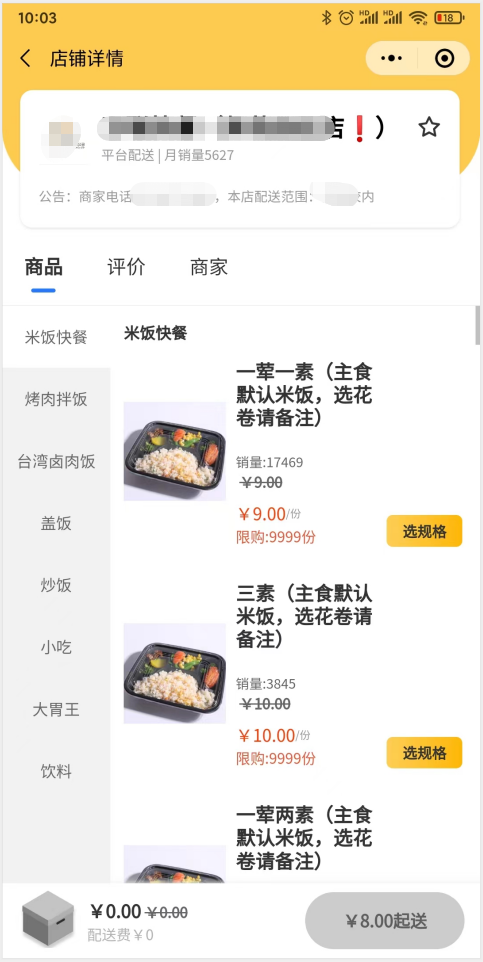
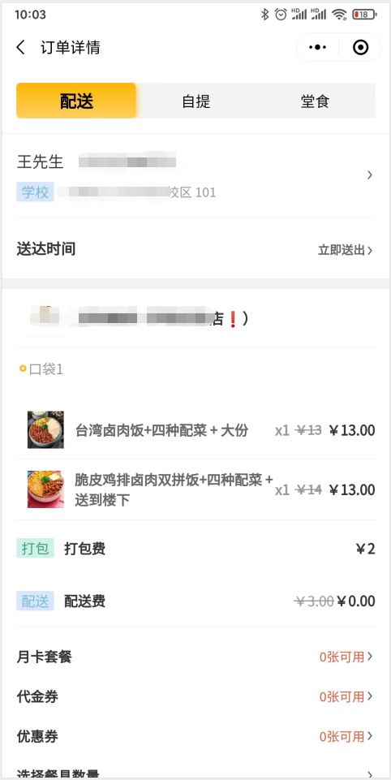

#### 配送端小程序界面展示

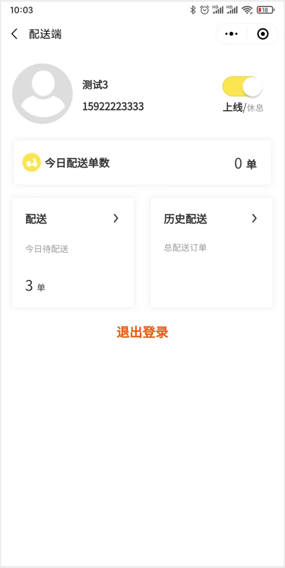
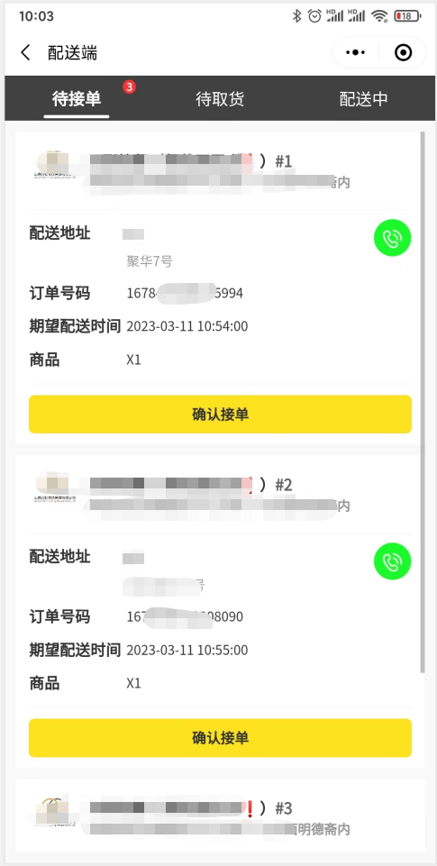
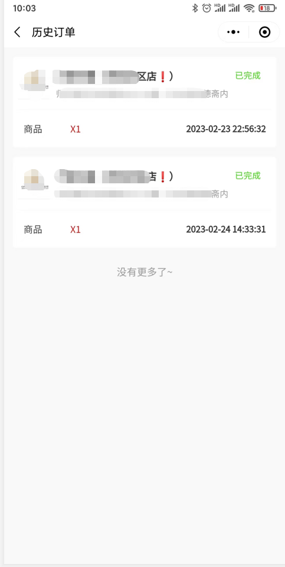

#### 联系方式

需要的联系，低价出售，私信联系我！！
